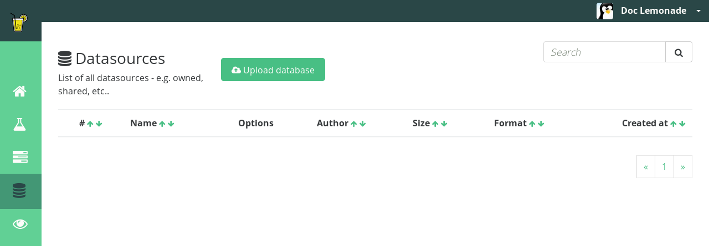
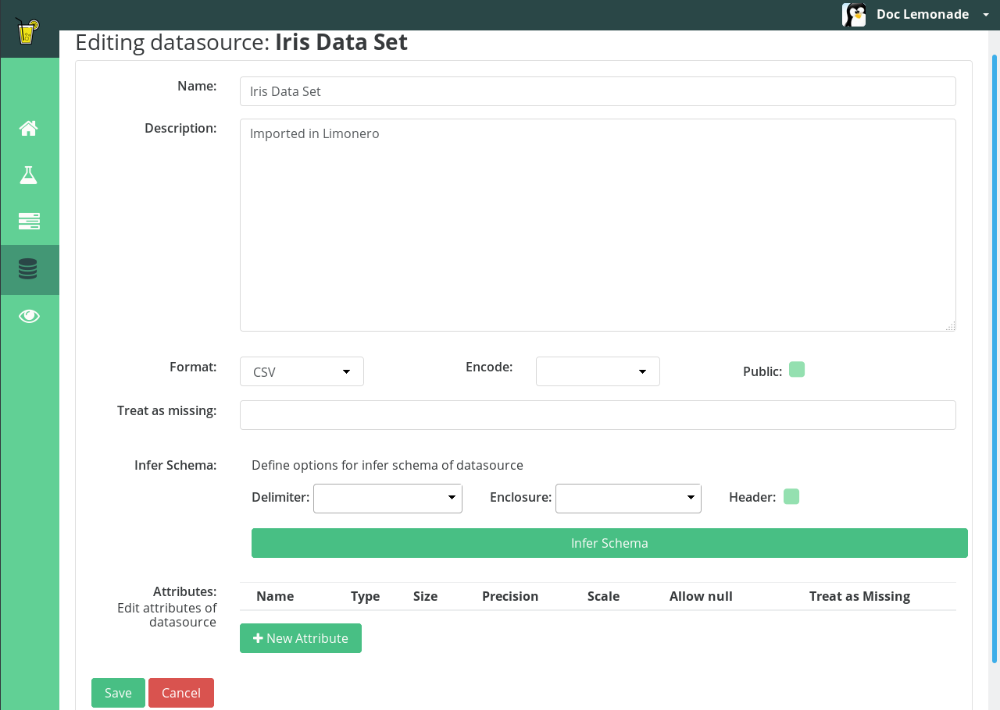
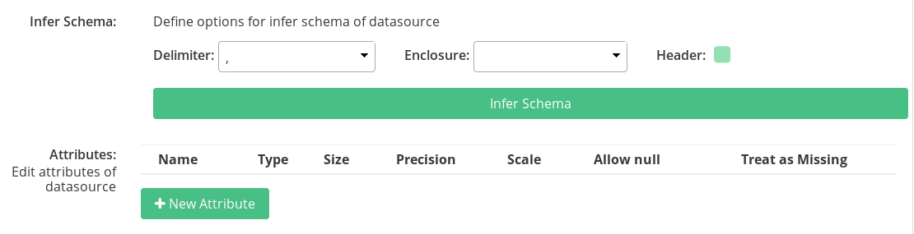
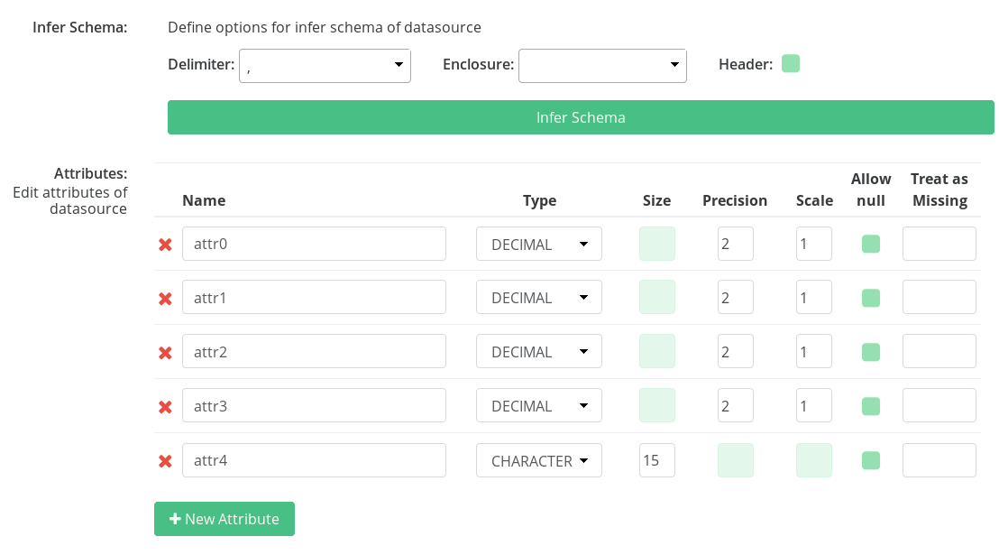
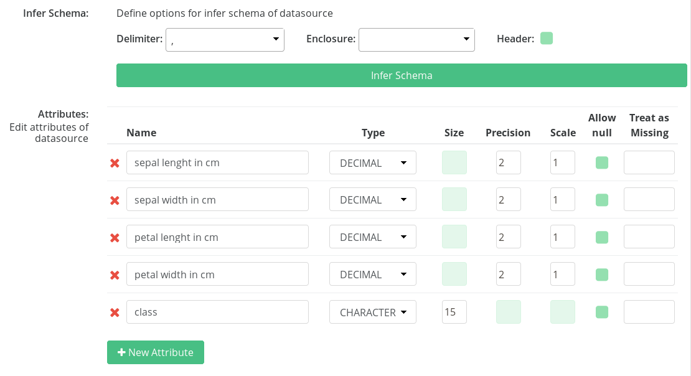
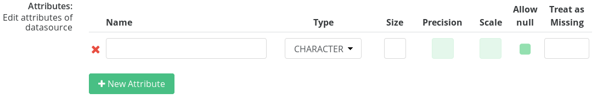

# Basic Usage

## Importing Data Sets

After creating an user and learning the platform's basic layout, you can
proceed to the import of data sets, that will be used as input in workflow
processes.
First off, click on the fourth icon of the sidebar, called "Datasources". This
screen will show up, and it's in it that the data sets you chose to use will
be managed.

To load a data set, click on `Upload database`, then drag a file from your
manager or select a file by clicking on `Choose your file`.

For this tutorial, we will be using the data set known as "Iris", one of the
most acknowledged databases to be found in the pattern recognition literature.
It is composed by 3 classes - 3 species of _Iris_' gender flowers -, of 50
instances each, and by 5 attributes, that are:

1. sepal lenght in cm
2. sepal width in cm
3. petal lenght in cm
4. petal width in cm
5. class (_Iris setosa_, _Iris Versicolour_ or _Iris Virginica_)

For more information, visit [Iris Data Set](https://archive.ics.uci.edu/ml/datasets/iris "Iris Data Set Homepage").

With the file uploaded, the data set appears on the screen, with some options
for its management and its basic data - its number on the platform, name,
author, size, format and creation date.

The management options are:

: Downloads the database that
was uploaded to the platform.

: Opens a sharing
options menu, that allows sharing the data set with other users.

: Deletes the database from the
platform.

: Opens an editing screen, that will be
explained in greater detail further.

On the editing screen, various options are shown. As it can be seen, the name,
which was the uploaded file's name, has been switched for a more meaningful
expression. The data set's description can also be altered.

Among the other fields, the editing screen is composed by:

*Format ->* It makes explicit the format in which the data set is. In the
example, the data set is in CSV format
*Encode ->* Encoding treatment to be used in the data set. e.g. UTF-8, LATIN 1,
etc.
*Public ->* Whether the data set can be seen and used by all of the platform's
users or not.
Treat as missing -> A value or expression to be treated as null or absent in
the data set. e.g. n/a, none, etc.
*Infer Schema ->* Infers the attribute schema for the data set, without the
need for manual addition. The process occurs in the following way:
  - Firstly, the *delimiter* of the data present in the set must be chosen. In
the example, it is the comma.
  - On second place, the punctuation sign used to highlight data, the
*enclosure*, must be chosen. This is an optional feature, and many data sets do
not use it, such as Iris. Therefore, nothing will be selected in the example.
  - Lastly, it must be chosen whether the data set has a *header* - that gives
name to the attributes - or not. Iris does not have it, thus it will not be
selected in the example.

  - With all those fields filled, click on `Infer Schema`, and the attributes
will be added, as it can be seen in the example.

  - Renaming the inferred attributes to the data set's attribute names
approached earlier, the schema appears in the following way.

*Attributes ->* Adds/edits attributes belonging to the data set, manually.
Contains the following fields:

  - Name -> Attribute's name
  - Type -> Corresponding data type. e.g. CHARACTER, FLOAT, DECIMAL, etc.
  - Size -> Data's size, in case it is non-numerical.
  - Precision -> Value's precision, used only for numerical data.
  - Scale -> Value's scale, also used only for numerical data.
  - Allow null -> Allow null values for the attribute.
  - Treat as Missing -> A value or expression to be treated as null or absent,
but specific for the attribute. e.g. n/a, none, etc.

To save changes made, click on `Save`, and to cancel those changes, click on
`Cancel`.
