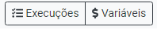
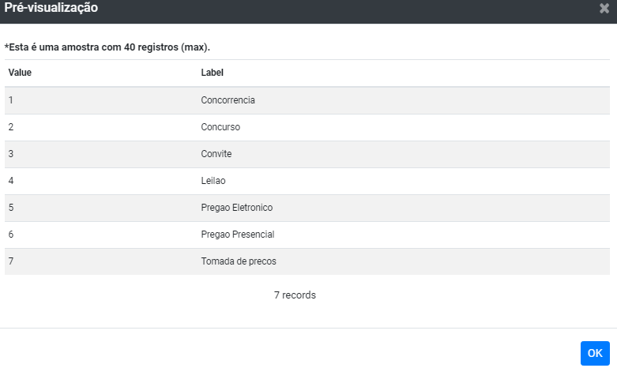

# Paineis Interativos (Trilhas)

Paineis interativos (ou Trilhas) permitem que projetistas criem fluxos de trabalho
e definam parâmetros do fluxo que serão definidos por usuários somente quando 
o fluxo for executado. São úteis para permitir que sejam criados paineis 
interativos, construídos a partir de visualizações de dados, onde o usuário tem 
a liberdade de definir formatações, filtros, agrupamentos, etc. 
Esta é a funcionalidade que mais se aproxima de um painel de 
_business intelligence_ no Lemonade.

A funcionalidade de Paineis Interativos do Lemonade é formado por duas partes: 
1. O editor de fluxos de trabalho.
2. Formulário de trilhas, destinados respectivamente ao projetista e ao usuário de trilhas.

## Usando o editor de fluxos de trabalho
Um fluxo de trabalho não está, por padrão,  habilitado para ser uma trilha. 
Para isto, é necessário mudar as propriedades do fluxo. 
Na barra de ferramentas no editor de fluxos do Lemonade, encontra-se o 
botão de propriedades do fluxo (engrenagem):

Ao clicar no botão, aparecerá a caixa de diálogo para as propriedades do fluxo. 
Nessa caixa, aparecem as opções para publicação de um fluxo como um painei 
interativo:

|Campo|Descrição|Valores válidos|
|-----|---------|-----------|
| Habilitar publicação do fluxo de trabalho |Se marcada, essa opção define que o fluxo poderá ser usado como uma trilha. | Habilitado ou desabilitado |
| Status da publicação | Status da publicação para a trilha. | `Em edição - Não está disponível para os usuários` ou `Publicado - Disponível para os usuários` |

FIXME: Rever termo trilha

Somente se o status for igual a `Publicado - Disponível para os usuários` é que a 
trilha aparecerá na lista exibida pelo menu `Trilhas` do Lemonade para outros usuários. 
Já o autor da trilha sempre a terá listada, independente do seu status, para que 
ele possa, por exemplo, ver como ela ficará para os demais usuários.

## Construindo o fluxo
A construção do fluxo é feita através do uso e configuração de tarefas e conexões. 
Nesse quesito, a trilha segue os mesmos passos usados para se criar um fluxo normal, 
com pequenas diferenças:
1. As operações que podem ser adicionadas na forma de tarefas são um subconjunto 
do conjunto total de operações disponíveis. Esse subconjunto pode ser 
configurado por um administrador e o propósito é restringir as operações que 
não são necessárias ou não podem ser adicionadas a uma trilha. 
Por exemplo, operações de construção de modelos não são adicionadas à trilha, 
uma vez que podem demorar a serem executadas, mas operações de inferência de 
modelos podem ser adicionadas. 
2. Existe agora uma operação chamada `Filtro de Usuário`. Ela é especial, pois 
não tem seus parâmetros preenchidos antes que seja feita a execução da trilha. 
Durante a construção da trilha, o autor de trilhas irá definir quais valores de 
filtros ele quer solicitar para o usuário de trilhas. É durante a execução que 
este último poderá informar os valores para os filtros, no formulário de trilhas. 

3. Para todas as tarefas, aparecerá uma nova aba chamada `Publicação` na área de 
Propriedades. Essa nova aba permite selecionar quais propriedades de uma 
tarefa serão expostas para que o usuário de trilhas possa alterar o valor 
durante a execução:

Mais detalhes sobre essa funcionalidade serão abordados na seção FIXME.

4. Aparece um novo botão na barra de ferramentas do fluxo, chamado de `Variáveis`.
Através dessa opção, o criador de trilhas poderá definir variáveis, que são 
marcações especiais que poderão ser usadas no fluxo, inclusive mais de uma vez. 
Mais detalhes sobre essa funcionalidade serão abordados na seção FIXME.
O fluxo de trabalho deve produzir algum tipo de visualização, usando as 
operações disponíveis. O Lemonade suporta mais de uma dezena de visualizações 
diferentes, como tabelas, gráficos de linha e barra. Uma trilha sem uma visualização 
não tem uso efetivo, uma vez que nada seria exibido para o usuário de trilhas, 
além de simplesmente uma mensagem de sucesso de execução.

## Criando um filtro de usuário
Um filtro de usuário é uma forma que o criador de trilhas pode solicitar 
parâmetros para a execução de uma trilha. O usuário de trilhas poderá informar 
os valores para os filtros através do Formulário de Trilhas (seção FIXME). 
Ao criar um filtro de usuário, você deve pensar quais são os atributos que podem 
ser usados como filtros. Ao usá-los, você estará aplicando uma condição (lógica) 
para a avaliação dos dados da tarefa imediatamente anterior ao filtro. Via de 
regra, o filtro de usuário sempre irá retornar uma lista de registros menor ou 
igual à sua entrada. Tecnicamente, é uma espécie de cláusula WHERE SQL (selection), 
onde os valores dos filtros estão aguardando a entrada por parte do usuário. 

Na Figura FIXME (acima), a tarefa “Filtro de usuário 1” está possivelmente 
limitando os dados provenientes de “Ler dados 0”. Assim, as tarefas subsequentes, 
“Gráfico de linha(s) 6” e “Agrupar linhas por função 3” devem estar fazendo 
uso de um subconjunto dos dados, mas isto só é determinado no momento da execução da trilha. 

Você poderá usar vários filtros de usuário, em geral, em partes diferentes do 
fluxo. Não faz muito sentido “cascatear” filtros de usuário, ou seja, ter um 
recebendo em sua entrada a saída de outro filtro de usuário, uma vez que você
 ode definir quantos filtros quiser de uma só vez. 
Para adicionar um filtro de usuário a um fluxo, basta localizá-lo na lista de 
operações e arrastá-lo para a área de desenho do diagrama. Para editá-lo, dê 
dois cliques sobre ele, para abrir a tela Propriedades:

São duas propriedades principais: a lista de filtros e se é para ignorar o filtro
durante a edição. A lista de filtros permite personalizá-los, definindo uma série 
de opções e está disponível para edição através do link “Escolha uma opção...”. 

A propriedade “Ignore ao executar em ambiente de edição” faz com que o filtro 
seja ignorado. É como se ele não estivesse no fluxo e houvesse um “curto-circuito” 
da sua entrada com sua saída. Caso essa opção não esteja habilitada, a 
execução poderá falhar se algum filtro, propriedade ou variável obrigatórios 
não tiver um valor padrão anteriormente definido. 

### Definindo os filtros de usuário

Ao clicar no link “Escolha uma opção...”, aparece a tela mostrada na Figura FIXME:

Inicialmente, essa tela aparecerá sem filtros. Você pode adicionar novos filtros clicando no botão “Adicionar”. Para excluir um filtro, basta clicar no ícone vermelho ao lado de cada um e para editar, basta clicar em um dos filtros. Ao clicar em um dos filtros, a tela muda para exibir as configurações:

| Campo | Descrição | Observações |
| -----------------| --------------------------------- | ----------------------------- |
| Atributo | Qual atributo será usado no filtro. | Numa analogia com a cláusula WHERE, seria: WHERE atributo `<operador>` valor. A lista de atributos contém aqueles disponíveis a partir da entrada da tarefa. |
| Identificador | Campo interno. | Não pode ser editado pelo usuário. | 
| Rótulo | Rótulo que aparecerá para o usuário no Formulário de Trilhas.  | Garanta que é um rótulo que seja facilmente entendido pelo usuário. |
| Tipo | Tipo de dados para o filtro. Por exemplo, o tipo poderá ser uma data, um valor inteiro, decimal ou um texto. | Valores válidos: FIXME |
| Operador | Qual operador será usado no filtro. | Valores válidos: FIXME |
| Valor-padrão | Valor que será assumido caso o usuário não informe outro.  | No Formulário de Trilhas, esse valor será apresentado para o usuário, que poderá então alterá-lo ou mantê-lo durante a execução. | 
| Multiplicidade | Quantas vezes o valor de entrada é esperado.  | Basicamente, indica se o campo é opcional, requer exatamente um valor, opcionalmente aceita vários valores ou necessariamente aceita múltiplos valores (pode ser um). |
| Índice para exibição | Qual será a ordem deste filtro no Formulário de Trilhas.  | Como há três formas de parametrizar e a possibilidade de definir vários campos, é importante usar essa opção para determinar a ordem de exibição. Todos os campos com índice de exibição aparecem primeiro. Aqueles sem essa informação aparecem por último, em uma ordem não definida. | 
| Ajuda | Ajuda que poderá ser exibida no Formulário de Trilhas. | Ver seção FIXME |

Você pode adicionar vários filtros de uma só vez. Cada vez que você clica no botão “Adicionar”, um novo filtro é criado e disponibilizado para edição. Você tem que necessariamente preencher todos os campos do filtro que são obrigatórios. 
Para remover um filtro, basta clicar no ícone vermelho com sinal de menos ao lado do nome.

::: warning Importante
Todos os filtros são combinados através da condição AND (não suporta outras condições de combinação de filtros). 
::: 

Filtros também podem estar associados à listas. Listas definem quais são os valores válidos para o filtro, limitando as escolhas do usuário ao conjunto definido. Listas podem ser de dois tipos: tabelas de referência ou uma lista de valores no formato JSON.

Tabelas de referência são fontes de dados no Lemonade, marcadas com a opção “Usar como tabela de referência” (disponível quando você edita uma fonte de dados).

A fonte de dados deve ter necessariamente 2 atributos, chamados de “value” e “label” (conforme figura abaixo). O valor de label é o texto apresentado para o usuário e value é o valor que será atribuído ao filtro.

Usar uma tabela de referência é interessante principalmente quando ela já existe e pode sofrer manutenções. Quando a tabela não existe e há poucos dados que o projetista de trilha quer usar, a alternativa é usar a opção “Lista de valores personalizados (use JSON)”. Neste caso, você tem que montar a lista na caixa de texto, observando que é uma lista de objetos que possuem os campos label e value. Por exemplo:
FIXME

| Campo | Descrição | Observações |
| ------| ----------| ------------|
| Associar a tabela de referência | Nome da tabela de referência (fonte de dados do Lemonade) | A fonte de dados deve ter a opção de usá-la como tabela de referência marcada.| 
| Lista de valores personalizados (use JSON) | Permite definir uma lista de valores no formato JSON. | Ainda não há validação na interface para garantir que o JSON é válido. Se inválido, a trilha pode não funcionar. |

Também é possível adicionar blocos de texto formatado antes e após um filtro. Na aba “Textos”, há duas opções, para antes e após o filtro:

Um subconjunto da linguagem Markdown (e portanto, HTML) é suportado. Por exemplo:
FIXME

| Campo | Descrição | Observações | 
| ------| ----------| ------------|
| Texto antes o campo (suporta Markdown) | Texto a ser exibido antes do campo do filtro, no formulário de trilhas. | Suporta um subconjunto de Markdown, mas evite abusar.|
| Texto após o campo (suporta Markdown) | Texto a ser exibido após o campo do filtro, no formulário de trilhas. | Suporta um subconjunto de Markdown, mas evite abusar. |

#### Limitações

Atualmente, o filtro de usuário exibe a aba “Publicação”. Não faz sentido manter essa aba e no futuro ela será removida. Por ora, recomenda-se não usá-la para filtro de usuário.
Deveria haver uma forma de informar os valores para os filtros no ambiente de edição, quando fosse ser feito um teste. 
Uma série de validações de entrada ainda precisam ser feitas, inclusive para os valores-padrão.
A combinação dos filtros é através da condição AND. Futuramente, poderá ser avaliado o suporte para a opção OR.

## Criando e usando variáveis
Variáveis são outra forma de parametrizar uma trilha. Uma variável pode ser definida pelo usuário ou ser definida pelo próprio Lemonade (neste caso, ela é chamada de variável de sistema). Você vai querer usar uma variável geralmente quando espera que um mesmo valor, informado pelo usuário, seja usado em vários lugares do fluxo. Por exemplo, imagine que há um fluxo com dados de duas ou mais fontes de dados, onde todas têm um campo chamado UF (unidade federativa) e a trilha poderá permitir filtrar por ele. Ao invés de perguntar o valor do campo para cada fonte de dados, você pode usar uma variável.

As variáveis são sempre associadas ao fluxo de trabalho e estão disponíveis através do botão “Variáveis”. Para que este botão esteja disponível, o fluxo tem que ter sido configurado para ser uma trilha. Ao clicar no botão, aparece a seguinte tela:

| Campo | Descrição | Observações | 
| ------| ----------| ------------|
| Nome | Nome da variável que será usado para referenciá-la no fluxo. | Não use nomes com espaço ou caracteres especiais, use apenas letras e números, pois não há ainda validação no código. |
| Rótulo | Rótulo que aparecerá para o usuário no Formulário de Trilhas.  | Garanta que é um rótulo que seja facilmente entendido pelo usuário. |
| Tipo | Tipo de dados para o filtro. Por exemplo, o tipo poderá ser uma data, um valor inteiro, decimal ou um texto.  | Valores válidos: FIXME |
| Valor-padrão | Valor que será assumido caso o usuário não informe outro.  | No Formulário de Trilhas, esse valor será apresentado para o usuário, que poderá então alterá-lo ou mantê-lo durante a execução. |
| Multiplicidade | Quantas vezes o valor de entrada é esperado.  | Basicamente, indica se o campo é opcional, requer exatamente um valor, opcionalmente aceita vários valores ou necessariamente aceita múltiplos valores (pode ser um). |
| Índice para exibição | Qual será a ordem deste filtro no Formulário de Trilhas.  | Como há três formas de parametrizar e a possibilidade de definir vários campos, é importante usar essa opção para determinar a ordem de exibição. Todos os campos com índice de exibição aparecem  rimeiro. Aqueles sem essa informação aparecem por último, em uma ordem não definida. 
| Descrição | Ajuda que poderá ser exibida no Formulário de Trilhas. | Ver seção FIXME | Lista de valores personalizados (use JSON) | Permite definir uma lista de valores no formato JSON. | Ainda não há validação na interface para garantir que o JSON é válido. Se inválido, a trilha pode não funcionar. |

Uma vez definida, a variável poderá ser usada em qualquer propriedade das tarefas do fluxo que seja do tipo texto (campos numéricos ou lógicos podem apresentar problemas, a implementação ainda está sendo feita). Por exemplo, a variável poderia ser usada para alterar o título de uma visualização ou mesmo no comando SQL da tarefa “Executar comando SQL”. 
FIXME: Adicionar figuras.

As variáveis de sistema existem independentemente da configuração de trilhas e podem ser usadas como as variáveis definidas pelo usuário. Note que os nomes dessas variáveis está em inglês: 

::: info Limitação
Uso de variáveis em campos numéricos e outros formatos requer que você use a publicação de propriedades (a seguir).
:::

### Publicando propriedades
A última forma de parametrizar uma trilha é através da exposição das propriedades das tarefas diretamente. Desta forma, as características das propriedades (rótulo e tipo) são herdadas. 

| Campo | Descrição | Observações | 
| ------| ----------| ------------|
| Propriedade | Nome da variável que será usado para referenciá-la no fluxo. | Não use nomes com espaço ou caracteres especiais, use apenas letras e números, pois não há ainda validação no código. |
| Rótulo | Rótulo que aparecerá para o usuário no Formulário de Trilhas.  | Garanta que é um rótulo que seja facilmente entendido pelo usuário. | 
| Índice para exibição | Qual será a ordem deste filtro no Formulário de Trilhas.  | Como há três formas de parametrizar e a possibilidade de definir vários campos, é importante usar essa opção para determinar a ordem de exibição. Todos os campos com índice de exibição aparecem  primeiro. Aqueles sem essa informação aparecem por último, em uma ordem não definida. |
| Associar a variável | Permite que o valor da propriedade seja associado ao valor de uma variável. | Desta forma, é possível associar variáveis que não sejam do tipo texto. | 
| Valor atual | | 

## Definindo os resultados de uma trilha
Os resultados da execução de uma trilha devem ser visualizações. Internamente, outros tipos de artefatos, como novas fontes de dados ou modelos de aprendizado de máquina podem ser construídos, mas o principal para a trilha são as visualizações. O Lemonade conta com dezenas de visualizações que podem ser usadas nas trilhas. Muitas vezes, as fontes de dados usadas nas trilhas ainda não estão no formato necessário para as visualizações, seja porque é necessário realizar transformações sobre os dados, seja porque é necessário filtrá-los ou mesmo agrupá-los. 

Uma trilha pode ter mais de uma visualização como resultado. Com isto, pode ser importante definir uma organização na hora de exibir as visualizações (por padrão, caso nada seja especificado, elas serão empilhadas, na ordem em que forem definidas no fluxo.

O editor de fluxo permite definir a coordenada (célula) inicial e a dimensão (altura e largura) das visualizações em um sistema de grade (grid), com número ilimitado de linhas e 12 colunas (mas evite usar um valor para linha acima de 30, pois pode sobrecarregar o navegador). 
A coordenada inicial é (1, 1), ou seja, linha 1, coluna 1. A configuração da coordenada inicial e da dimensão estão disponíveis na janela Propriedades, acionada com dois cliques em uma tarefa do tipo visualização:

Ao clicar no link “Alterar opção…”, aparece a tela de configuração:

No exemplo, a visualização começa na coordenada (0, 0) (primeira célula da grade) e se estende por todas as colunas (largura = 12) e por 3 linhas (altura = 3). Caso haja alguma colisão entre visualizações, estando uma “sobrepondo” a área de outra, as visualizações são reorganizadas em pilha, sequencialmente. 

::: info Testando uma trilha no editor de fluxos de trabalho
Ao testar uma trilha na tela de edição de fluxo, você ainda consegue clicar e acionar no botão “Executar”.
::: 

### Disponibilizando uma trilha

Uma trilha passa a estar disponível para os demais usuários somente quando seu status de publicação é alterado para “Publicado - Disponível para os usuários”. Antes disso, somente o projetista de trilhas tem acesso à trilha na tela de listagem.
Outras configurações são importantes para a exibição da trilha nas telas de listagem e de execução:

| Campo | Descrição | Observações | 
| ------| ----------| ------------|
| Nome | Nome do fluxo de trabalho, que também é usado para nomear a trilha.  | O nome é usado nas telas como forma de identificar a trilha e também o seu propósito.  | 
| Cluster preferencial para execução | Cluster onde a trilha será executada. | A trilha precisa de um cluster de máquinas para ser executada. A adição de novos clusters pode ser feita por um administrador do Lemonade. | 
| Descrição | Um texto descrevendo a trilha, como por exemplo, seu propósito (complementar ao nome), características ou quaisquer outras informações que o projetista queira passar para o usuário. | Complementar ao nome, esta informação é opcional. |

As opções “Disponibilizar este fluxo de trabalho como modelo” e “Disponibilizar este fluxo de trabalho como um modelo para todos os usuários” não são importantes para as trilhas.

## Execução de trilhas

### Listagem
Estando a trilha disponível para o usuário, ele poderá acessá-la através da opção de menu “Trilhas”. Aparecerá a tela de listagem de trilhas:
FIXME Adicionar imagem

Ao clicar em um dos links no nome da trilha, o usuário é redirecionado para a tela de formulário de trilhas. Essa nova tela é “dinâmica”, isto é, o seu conteúdo pode mudar, de acordo com a parametrização da trilha. Portanto, a quantidade, ordenação, propósito, etc, dos campos presentes no formulário e também as visualizações geradas como resultado variam de trilha para trilha.
Dois botões estarão sempre disponíveis: Ajuda e Pesquisar (descritos à frente).

### Informando os valores para os filtros
O usuário de trilhas deve necessariamente informar todos os campos obrigatórios do formulário de trilhas. Os campos obrigatórios são destacados em negrito e têm um asterisco (*) em seu rótulo. Alguns campos podem já vir com valores sugeridos. Relembrando, isso se deve à configuração de valor-padrão feita pelo projetista de trilhas, durante a sua construção. Os componentes gráficos de entrada seguem padrões estabelecidos pelo tipo de dados, pelo uso de listas e pela multiplicidade, também definidos durante a construção do fluxo da trilha. Por exemplo, se um filtro, variável ou propriedade é do tipo Data, o formulário exibirá um calendário para a escolha do valor; se está associado a uma tabela de referência, uma caixa de seleção é usada. 

O botão Pesquisar dispara a execução da trilha. Nesse momento, o Lemonade envia os valores informados nos filtros para o servidor, valida os dados e se tudo estiver certo, começa a executar a trilha. A área de resultados muda, inicialmente mostrando indicadores de “aguarde” (figura girando) e à medida que os dados vão sendo recebidos.

::: warning Importante
A validação dos dados do formulário da trilha ainda está pendente. Não use valores inválidos e preencha os campos obrigatórios, pois do contrário, a execução poderá falhar. 
:::

### Ajuda
O botão Ajuda exibe uma nova tela com a ajuda para os campos, definida anteriormente para a trilha. 

### Botão de informações
O botão de informações apresenta informações sobre o fluxo de trabalho (nome, autor, data de criação e alteração e cluster de execução preferido). Futuramente, outras informações poderão ser adicionadas.

## Considerações finais
Para entender as partes que compõem a solução da trilhas no Lemonade, é importante entender qual a causa e a consequência de cada configuração. Por exemplo, ao adicionar o texto no campo Ajuda quando criando um filtro, você tem que entender que aquele texto aparecerá quando o usuário de trilhas clicar no botão Ajuda na tela de formulário de trilha. A escolha do tipo da variável ou a sua associação a uma lista de opções altera qual componente de entrada será usado. As visualizações adicionadas ao fluxo são exibidas como resultado do processamento da trilha e cada uma pode ser posicionada e redimensionada de acordo com a configuração ainda na edição do fluxo de trilha. 

Conseguir perceber essas interações irá certamente facilitar o seu trabalho de  construção de trilhas no futuro. 

