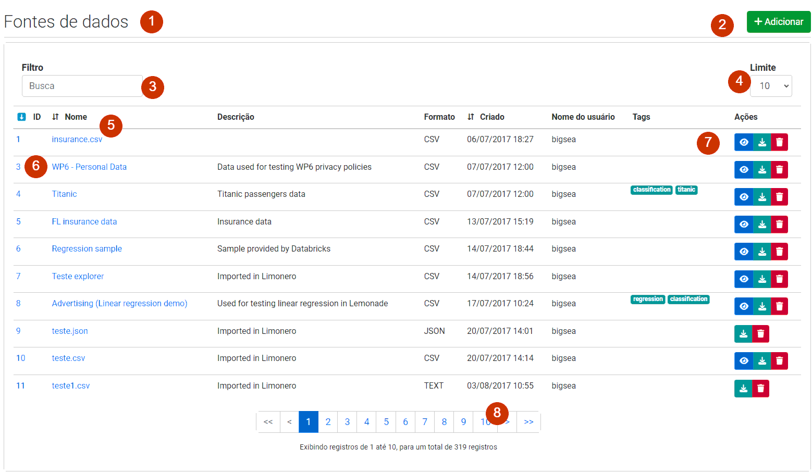
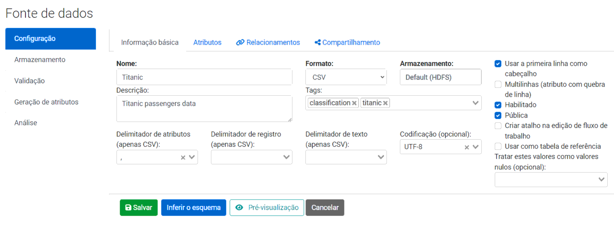

# Interface de usuário

A interface (web) de usuário do Lemonade é bem simples na maior parte dos casos. 
Em geral, há 2 tipos de telas mais comuns:

1. Telas de listagens e consulta de artefatos.
2. Telas de detalhes sobre os artefatos.

Os artefatos disponíveis no Lemonade incluem fluxos de trabalho, 
fontes de dados, _dashboards_, etc, itens de administração (usuários, grupos, 
armazenamentos, configuração, etc) e suas telas de gererenciamento no Lemonade
seguem alguns padrões.

## Telas de listagem e consulta de artefatos
As telas de listagem e consulta de artefatos apresentam os dados de forma paginada, 
permitindo a aplicação de filtros e ordenação. Podem haver pequenas diferenças 
de uma tela de listagem para outra, mas no geral, elas são bem parecidas.
A imagem a seguir é um exemplo de tela de listagem e apresenta seus principais 
componentes, identificados por números:

Elementos da tela de listagem:
1. Título do artefato listado;
2. Botão de adicionar novo artefato;
3. Opções de filtro da listagem;
4. Opção de limitar a quantidade de registros retornados;
5. Colunas com opções de ordenação (nem todas as colunas são ordenáveis);
6. Uma linha para cada registro, com _links_ para a tela de edição;
7. Botões de ação (cada tela pode ter um conjunto diferente);
8. _Links_ de paginação.

Os botões de ação apresentam uma dica (_tooltip_) quando você passa o ponteiro 
do mouse passa por cima e informa qual a ação. Na imagem, por exemplo, os botões
servem para exibir uma amostra (botão azul com olho), baixar a fonte de dados 
(botão esverdeado com seta para baixo) e excluir (botão vermelho com lata de lixo).

## Telas de detalhes sobre os artefatos
As telas de detalhes dos artefatos são acionadas quando se clica o botão `Adicionar`
na tela de listagem ou se clica no _link_ para a edição. Diferentemente das telas
de listagem, as telas de detalhes podem variar bastante de um tipo de artefato 
para outro. Por exemplo, a tela de edição de Fonte de Dados, mostrada na imagem
a seguir, é bem mais complexta do que a tela de edição de usuários. Por sua vez, 
nenhuma das duas tem tantos detalhes e recursos quanto a tela de edição de 
Fluxos de Trabalho. Ainda existem telas bem simples, que só mostram dados, sem 
permitir a edição, como é o caso da tela de Execuções.

Em geral, as telas terão um botão para salvar as alterações. 
