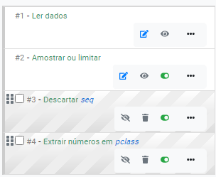

# Transformação de dados

Assemelha-se a uma planilha de dados, sem permitir a edição direta de células. 
As alterações (ou transformações) que são feitas na tabela são disparadas por 
meio de comandos selecionados em menus da interface de usuário. Busca-se o menor 
tempo possível de latência, para que o usuário não tenha que esperar muito para 
ter um retorno sobre sua ação. Por essa razão, em geral, a parte de 
transformação de dados irá trabalhar com amostras dos dados de entrada. A 
execução das ações sobre todo o conjunto de dados poderá ser feita quando o 
usuário julgar que a construção do fluxo está pronta. Um fluxo é uma sequência 
de ações (ou passos) que são executadas sequencialmente sobre a amostra de 
dados. Internamente, o fluxo ainda é um fluxo válido no Lemonade e, dessa forma, 
possui todas as características e funcionalidades definidas anteriormente, em 
outras atividades de projetos anteriores, tais como suporte a diferentes 
plataformas de processamento, acesso a dados, otimizações, auditoria e 
segurança, etc.

Ao escolher o item 1, aparece a tela de criação para uma nova análise pelo 
Data Experiments (Figura 3). Essa tela solicitará o nome do fluxo e qual a 
fonte de dados será utilizada. Ambas as informações poderão ser alteradas 
posteriormente. O nome do experimento é um texto livre, mas recomenda-se que 
seja utilizado um nome representativo do propósito do fluxo. A fonte de dados é 
escolhida informando-se parte de seu nome. Uma lista de fontes de dados, cujo 
nome “casou” com o padrão de pesquisa, é exibida, permitindo ao usuário 
selecionar uma delas.

## A área de edição de fluxo do Data Experiments
Após confirmar o nome e a fonte de dados, clicando no botão “Criar”, o Lemonade 
exibe a tela principal do Data Explorer, como na Figura 4.

Há 7 áreas onde o usuário pode interagir com a interface, representadas na 
Figura 4 pelas marcações em vermelho:

1. Nome do fluxo: permite mudar o nome do fluxo, anteriormente definido;
2. Cluster a ser usado para processamento: no Lemonade, um cluster é uma configuração que permite executar o fluxo em diferentes ambientes, com diferentes parâmetros (número de máquinas, memória, bibliotecas, etc). A lista de clusters disponíveis é mantida por algum administrador do Lemonade (menu Administração).
3. Opção de comandos para múltiplos itens: permite aplicar um comando de edição aos itens (disponíveis em 5 e chamados de etapas) que estejam selecionados. Os comandos são mostrados na figura a seguir:

4. Botão para salvar o fluxo: caso esteja desabilitado, é necessário rever as etapas para garantir que todos os campos obrigatórios foram preenchidos;
5. Menu de comandos: exibe a lista de comandos que poderão ser aplicados ao fluxo. Os comandos podem estar relacionados ao fluxo ou a uma ou mais colunas dos dados. Para estarem habilitados, os menus que criam uma etapa (item 6) a partir de uma coluna exigem que uma coluna esteja selecionada na área de resultados. Mais detalhes na seção 4.2.2;
6. Lista de etapas: exibe a lista de etapas do fluxo. Essas etapas sempre são executadas de forma sequencial. Note que as duas primeiras etapas, “Ler dados” e “Amostrar ou limitar”, sempre estarão nessas posições (não podem ser reordenadas). A reordenação de etapas e outras ações que poderão ser aplicadas serão discutidas na seção 4.2.3;
7. Área de resultados: a área de resultados é uma tabela que exibe o estado atual dos dados, após a execução de cada etapa (habilitada) do fluxo. Assim que uma etapa é adicionada, removida ou alterada, a área de resultados é atualizada para refletir a ação. Essa área também suporta a criação de novas etapas através de seu menu de contexto

## Menu de comandos do Data Explorer
O menu de comandos está associado às opções descritas na seção 3 deste documento 
e é mostrado na Figura 4 como o item 5. Basicamente, há três tipos de ações que 
podem ser feitas a partir do menu de comandos:
Comandos que afetam o fluxo;
Comandos que criam novas etapas a partir de uma coluna selecionada.

## Interagindo com as etapas do fluxo no Data Explorer
A lista de etapas do fluxo no Data Explorer permite que o usuário configure 
diferentes propriedades das etapas, como elas se organizam dentro do fluxo 
(ordem), quais estão desabilitadas e quais são visualizadas na área de 
resultados.
Cada etapa tem um conjunto próprio de propriedades, que definem como a sua 
execução será feita. O conjunto de propriedades está relacionado ao tipo da 
etapa. Por exemplo, a etapa “Ler dados” tem a propriedade “Fonte de dados”, 
que é exclusiva dela. Para editar as propriedades de uma etapa, basta clicar 
no botão Editar .

Figura 6: Elementos da lista de etapas

A Figura 6 mostra os elementos da lista de etapas. Além do botão Editar, próximo ao número 1 da figura, temos os botões Salvar  e Cancelar (próximos ao número 2), os botões Pré-visualizar , Excluir , Habilitar/Desabilitar  (próximos ao número 3). Cancelar a edição desfaz quaisquer alterações feitas nas propriedades da etapa. 
Excluir elimina a etapa do fluxo, enquanto Habilitar/Desabilitar mantém a etapa, mas faz com que ela seja ignorada durante a execução do fluxo. É interessante usar essa última opção quando você quer temporariamente ignorar a etapa, ao invés de excluí-la definitivamente. 
O menu suspenso para a etapa, exibido próximo ao número 4 da figura, permite adicionar um comentário para a etapa e personalizar a sua cor. Também permite duplicar a etapa (a figura mostra o termo “passo”, mas já foi corrigido na versão final).
O ícone de arrastar  permite mover uma etapa, portanto, reordenando-a dentro do fluxo de trabalho. Importante: como o fluxo é sempre executado de forma sequencial, reordenar suas etapas pode fazer com que ele pare de funcionar. Por exemplo, se uma etapa A cria uma nova coluna, usada pela etapa B, trocar a ordem dessas tarefas entre si fará com que a coluna referenciada em B não exista nos dados, causando um erro. Também, por essa razão, as duas primeiras etapas, “Ler dados” e “Amostrar ou limitar” não podem ser reordenadas.
O botão de Pré-visualização permite que você veja o resultado total ou parcial da aplicação das etapas do fluxo. Pode ser entendido como uma opção “visualizar o resultado até aqui”. A última etapa onde o botão de Pré-visualização foi clicado determina até onde a execução mostrará a pré-visualização. Todas as etapas posteriores àquela selecionada para a pré-visualização não serão processadas e são representadas no Data Explorer como na Figura 7.

Figura 7: Etapas 1 e 2 serão pré-visualizadas, etapas 3 e 4 não serão (foi selecionado o botão pré-visualizar da etapa 2)

## Menu de contexto da área de resultados
A área de resultados possui um menu de contexto, ativado com o clique do botão direito do mouse, em cima de uma célula da tabela. Esse menu pode ser visto na Figura 8.

Figura 8: Menu de contexto da área de resultados

O menu de contexto usa o valor da célula clicada e permite criar novas etapas para o fluxo usando esse valor. Posteriormente, a etapa poderá ser alterada, sem manter qualquer vínculo com a célula original.
