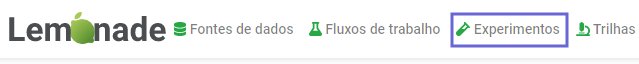
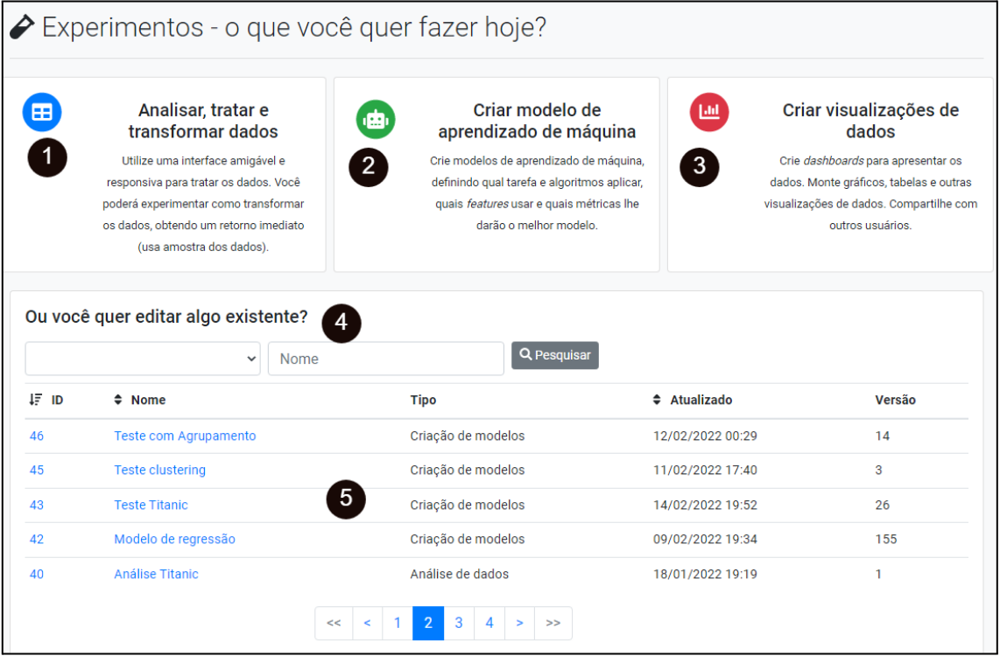

# Criando experimentos

Para criar um novo experimento no Lemonade, é necessária a versão 2.4.0 ou 
posterior do Lemonade e que o usuário tenha permissão para essa funcionalidade. 
Se ambas as condições forem satisfeitas, o usuário, após se autenticar no 
Lemonade, terá uma opção de menu chamada de _Experimentos_, 
como mostrado na figura a seguir:

.

A parte de experimentos no Lemonade contempla por 3 módulos: transformação de 
dados, visualização de dados e construção de modelos de aprendizado de máquina. 

. FIXME: Rever, pois há novos ícones para ordenar.

Na Figura anterior, os números de 1 a 3 mostram botões para criação de novos fluxos para cada um dos três módulos de experimentos (mais detalhes nas próximas seções). 
O número 4 mostra a área de filtro, onde o usuário pode filtrar pelo tipo ou nome do fluxo. 
A área marcada com o número 5 mostra a listagem de experimentos que atenderam os filtros. Na listagem, é possível ainda ordenar o resultado pelo identificador (ID) do experimento, pelo nome ou ainda pela data da última alteração.

Para editar um fluxo anteriormente criado pelo Data Experiments, basta localizá-lo na listagem e clicar o link em seu número ou nome. 

Para entender os módulos de experimentos, consulte os textos a seguir:

- [Transformação de dados](./data-explorer/)
- [Visualização de dados](./visualization-builder/)
- [Construção de modelos de aprendizado de máquina](./model-builder/)
