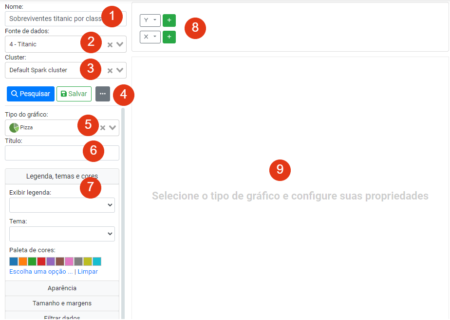

# Visualização de dados

Possibilita a criação de gráficos e outras visualizações a partir dos dados transformados usando o módulo anterior. Assemelha-se a uma ferramenta de construção de dashboards de BI (Business Intelligence), ainda que mais simplificada e com foco no entendimento dos dados. O objetivo é manter o usuário em uma única aplicação.

# Construtor de visualizações

O construtor de visualizações é uma ferramenta que permite criar diversos tipos 
de visualizações, tais como gráficos, tabelas e indicadores de forma fácil e 
rápida usando o Lemonade. Com esta ferramenta, é possível personalizar 
diferentes aspectos dos gráficos, configurar as dimensões de entrada e opções 
para eixos, bem como adicionar cores e legendas para deixar as visualizações 
mais atraentes e informativas.

Além disso, as visualizações geradas podem ser exportadas para 
[dashboards](../../dashboards/) no 
próprio Lemonade, permitindo que os usuários tenham acesso a todas as suas 
informações em um único lugar. É possível também exportá-las como imagem, 
o que é útil para incluir em relatórios e apresentações ou ainda exportar 
a visualização como código-fonte Python, para executá-la usando a biblioteca 
[Dash](https://plotly.com/dash/).

## Visualizações disponíveis

    

        

            <strong><a :href="`${type.name}`">{{type.label}}</a></strong>
        

        

            
        

    

## Criando a primeira visualização
Após clicar no botão “Criar um novo experimento”, aparece a tela da Figura 24. Os itens 1 e 2 da Figura 24 permitem mudar as informações de nome e fonte de dados definidas no passo anterior. O item 3 permite especificar o cluster de execução, da mesma forma que pode ser feito em outras partes já discutidas neste documento. 
O item 4 exibe os botões de ação: Pesquisar, Salvar e de ações complementares (reticências). 
O item 5 permite mudar o tipo do gráfico definido anteriormente. O item 6 é para informar o título do gráfico, enquanto o item 7 apresenta as várias opções de configuração para o gráfico (essas opções serão discutidas à frente). 
Por fim, os itens 8 e 9 mostram duas áreas. A primeira é a área das dimensões e eixos e a segunda é onde a visualização é exibida. A área de dimensões e eixos é dinamicamente construída, dependendo do tipo do gráfico. Alguns tipos de visualização suportam a configuração dos eixos X e Y e adição de várias dimensões. Outros tipos podem suportar um subconjunto dessas configurações. Essas áreas serão discutidas mais à frente neste documento.

## Configurações comuns a todas as visualizações

Ass opções de configuração a segir são comuns a todas ou quase todas as visualizações:

<table>
    <tr>
        <th>Configuração</th>
        <th>Descrição</th>
        <th>Observações</th>
    </tr>
    <tr>
        <td>Nome</td>
        <td>Nome do experimento</td>
        <td></td>
    </tr>
    <tr>
        <td>Fonte de dados</td>
        <td>Fonte de dados usada como entrada para o experimento</td>
        <td>
            Após criar e configurar uma visualização, trocar a fonte de dados
            pode fazer com que o experimento pare de funcionar, caso a nova fonte
            de dados não tenha algum dos atributos usados para construir a 
            visualização.
        </td>
    </tr>
    <tr>
        <td>Cluster</td>
        <td>Cluster (máquinas) onde o experimento será executado</td>
        <td>
            Em geral, permite escolher opções como memória e CPUs que estarão 
            disponíveis para o experimento. Em caso de dúvida, escolha o valor padrão.
        </td>
    </tr>
    <tr>
        <td>Tipo da visualização</td>
        <td>Tipo da visualização a ser gerada</td>
        <td>
            Você pode trocar o tipo de visualização a ser gerada. 
            Dependendo da compatibilidade entre as visualizações, alterar essa 
            opção pode funcionar corretamente. Entretanto, se o tipo da 
            visualização selecionado for incompatível com o anteriormente 
            selecionado, você terá que ajustar as outras opções de forma apropriada, 
            do contrário, o experimento poderá falhar.
        </td>
    </tr>
    <tr>
        <td>Título</td>
        <td>Título para o gráfico</td>
        <td></td>
    </tr>
    <tr>
        <td></td>
        <td></td>
        <td></td>
    </tr>
</table>

## Configurando os eixos e dimensões da visualização

## A área da visualização
A área de visualização é o espaço onde a visualização é exibida. Dependendo das 
opções definidas, a visualização pode ser maior do que a área de exibição. A 
visualização é interativa, ou seja, você pode usar o mouse para habilitar ou 
desabilitar séries, mover por cima de itens e ver mais informações, ou ainda usar
os recursos providos pela biblioteca gráfica (Plotly) para exportar a 
visualização como uma imagem.

## Opções de formatação
### Cores
<table>
    <tr>
        <th>Configuração</th>
        <th>Descrição</th>
        <th>Observações</th>
    </tr>
    <tr>
        <td>Exibir legenda</td>
        <td>Permite exibir/ocultar a legenda</td>
        <td>Diferentes opções de posicionamento da legenda estão disponíveis</td>
    </tr>
    <tr>
        <td>Paleta de cores</td>
        <td>Paleta de cores (discreta) usada para a visualização</td>
        <td>
            Algumas visualizações não usam a paleta de cores, pois esta é uma
            lista discreta de itens. Para visualizações como o 
             <a href="./treemap.html">mapa em árvore</a>, que precisam de uma 
            escala de cores, configure a propriedade com esse nome. Quando o 
            número de dimensões de dados é maior do que o número de cores da paleta,
            as cores começam a se repetir, por isso, <b>escolha uma paleta 
            que tenha cores suficientes</b>. 
        </td>
    </tr>
    <tr>
        <td>Escala de cores</td>
        <td>Escala de cores usada para a visualização</td>
        <td>
        </td>
    </tr>
</table>

## Conceitos avançados
### Criando subgráficos
Subgráficos são gráficos que usam a mesma fonte de dados, mas são segmentados 
(divididos) por um atributo. Cada valor para o atributo escolhido gera um novo 
subgráfico. Por exemplo, para um atributo `dia da semana`, usado para a segmentação, 
seriam gerados 7 subgráficos. Já para um atributo _booleano_, como `sobreviveu` ou
`inadimplente`, 2 subgráficos são gerados. Note que você deve primeiro discretizar 
valores contínuos ou categóricos que contenham muitos valorse, caso contrário, a 
quantidade de subgráficos gerados deixará a visualização inlegível, com 
vários pequenos subgráficos na tela.

### Criando animações em gráficos

### Exportação para o _Dash_

