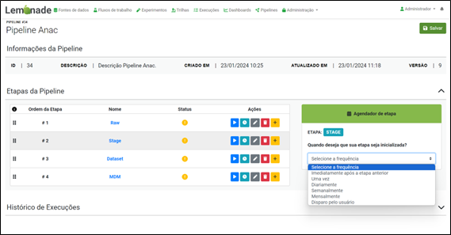
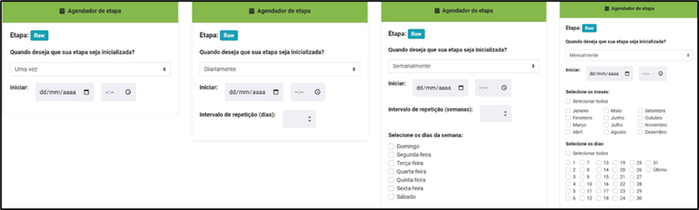

# Agendamento de execução

A execução de cada uma das etapas de uma pipeline deverá ser definida pelo engenheiro de dados. Neste sentido, para cada uma dessas etapas será apresentada o “Agendador de etapa” que oferece seis possibilidades de agendamento como ilustram as figuras abaixo. As possibilidades são:

- Imediatamente após a etapa anterior: neste caso, a execução da etapa será disparada após o término da etapa imediatamente anterior. É importante destacar que esta opção não é válida para a primeira etapa da pipeline;
- Uma vez: caso o usuário selecione esta opção, a etapa da pipeline será executada apenas uma vez e na data e hora pré-definida;
- Diariamente: esta opção dispara a etapa da pipeline todos os dias na data e hora pré-definida;
- Semanalmente: ao selecionar esta opção o usuário poderá definir a data e a hora da primeira execução. Ademais, deverá ser selecionado o intervalo entre as semanas de execução e, também, quais são os dias em que se deseja efetuar a execução da etapa;
- Mensalmente: de forma similar à opção anterior, é permitida a seleção dos meses em que o processo será disparado e, também, indicar quais são os dias em que a execução deverá ocorrer;
- Disparo pelo usuário: esta opção define que a etapa irá "esperar" até que o usuário execute a mesma, manualmente.

