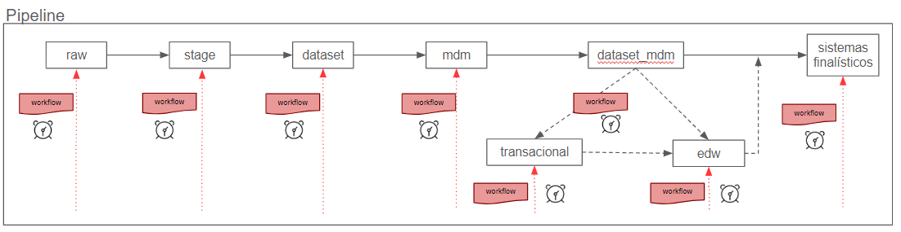

# Pipelines

Uma Pipeline, no contexto de Ingestão de Dados, pode ser entendida como uma sequência de etapas automatizadas que transferem dados de diversas fontes para um destino final, onde eles podem ser armazenados, transformados e analisados. Essa pipeline pode ser projetada para funcionar em lote ou em tempo real, dependendo das necessidades do negócio. 

No contexto da LEMON uma pipeline representa a realização de um processo de ingestão de dados associado a uma fonte de dados que pode ter como base uma sequência de etapas associadas a processos de transformações de dados definidos pelos usuários. Essas etapas são definidas de forma flexível, ou seja, a critério estabelecido pelo usuário mas, também, podem ser reaproveitadas a partir de um repositório de modelos, também conhecido como Template Pipeline. Pode-se entender que uma template é uma representação de um processo de ingestão de dados que possui as mesmas etapas e que pode ser usado como modelo para a criação de novas pipelines.

Entende-se como Etapa de Pipeline uma camada do processo de ingestão de dados do cliente LEMON/LEMONADE. Assim, cada etapa aplica um conjunto de processamentos associado a base que está passando pelo processo de ingestão de dados. No contexto da LEMON, o Engenheiro de Dados tem a possibilidade de agendar o dia e hora em que cada uma das etapas das Pipelines serão executadas sendo possível, também, estabelecer o seu encadeamento (que define as dependências entre etapas) e o que deve ser executado (fluxo de trabalho).

Por fim, a LEMON incorpora o conceito de fluxo de trabalho fornecido pela plataforma LEMONADE. Um Fluxo de Trabalho, ou Workflow, representa o encadeamento de tarefas básicas de transformação de dados. Essa separação em tarefas é definida pelo engenheiro de dados e é recomendável que sejam simples e foquem em uma ação. Um exemplo de tarefa é um comando SQL que cria uma tabela, uma consulta ao banco de dados, uma validação de dados de uma coluna, transformações de datas ou, por fim, um script Python que realiza um processamento. A Figura abaixo ilustra uma Pipeline composta por etapas de processamento em que cada uma delas está associada a um Fluxo de Trabalho que pode ser agendado para executar conforme configuração dos engenheiros de dados.

Uma Pipeline é um conjunto de etapas sequenciais que representam um único processo de ingestão de dados. Geralmente, a Pipeline estará associada a uma certa fonte de dados. Por exemplo, para dados provenientes de uma base de dados denominada ANAC, uma Pipeline será criada e formada por etapas associadas a cada camada (ex. raw, stage, dataset, etc), definida no processo de ingestão de dados do cliente LEMON/LEMONADE.

Cada etapa tem a sua própria definição de regra para execução. A etapa poderá ser disparada manualmente, recorrentemente (por meio de uma configuração de periodicidade, no estilo crontab) ou ainda ser configurada para disparar logo após o término da etapa anterior da mesma Pipeline. 

No Lemonade, a definição da lógica do que deve ser executada no processo de ingestão é definida por meio de [Fluxos de Trabalho](../workflows/index.md). No Lemon, cada etapa deve estar associada a um Fluxo de Trabalho para que possa ser válida e executada. Note que um mesmo Fluxo de Trabalho pode ser associado a mais de uma etapa, caso faça sentido. O LEMONADE provê o conceito de variáveis para o Fluxo de Trabalho, que teoricamente, permitiriam usar um Fluxo de Trabalho em diferentes processos de ingestão, desde que as variáveis sejam corretamente definidas.

Caso seja identificado que vários processos de ingestão de dados guardem similaridade (ou seja, tenham as mesmas etapas), o usuário do LEMON poderá definir um Modelo de Pipeline (Template Pipeline). Desta forma, ao criar novas Pipelines, o usuário pode iniciar a partir de um modelo e não precisará definir todas as etapas novamente.

## Tópicos relacionados

Para mais informações a respeito de alguns tópicos relacionados ao contexto de pipelines, acesse as seções abaixo.

- [Templates para Pipeline](../pipelines/pipeline-template.md)
- [Gestão de Pipelines](../pipelines/pipeline-management.md)
- [Agendamento de execução](../pipelines/execution-schedule.md)
- [Monitoramento de execução](../pipelines/monitoring.md)
- [Biblioteca de Código Python](../pipelines/lib-codigo-python.md)
- [Utilizando UDFs](../pipelines/udf.md)
