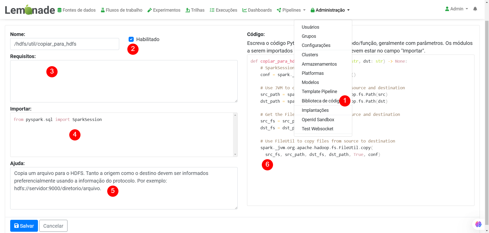
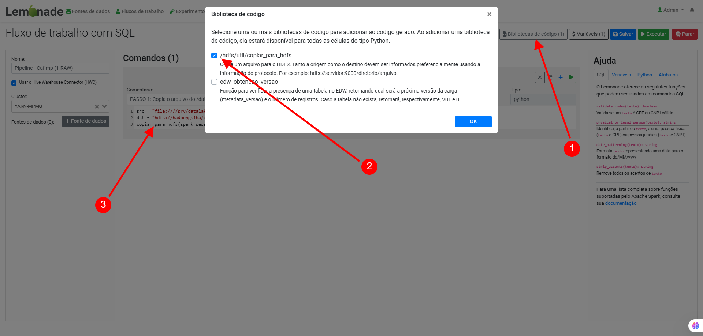

# Biblioteca de Código

Com a introdução do suporte a scripts Python no fluxo de trabalho SQL, a possibilidade de ter bibliotecas de código Python que pudessem ser reaproveitadas, de forma similar ao que foi feito com para as bibliotecas para o Spark se tornou interessante. Mas, diferentemente, as bibliotecas de código Python não precisam ser instaladas no ambiente do LEMON e podem ser definidas através de uma interface disponibilizada para o administrador. Isso traz grande flexibilidade para o uso do LEMON.

A Figura abaixo mostra a tela de edição de uma biblioteca de código Python. Nela, pode ser visto um exemplo real de uso: copiar um arquivo do sistema de arquivos do servidor para o HDFS. O acesso a esta funcionalidade é feito pelo menu de Administração (#1). A biblioteca pode receber um nome (#2), uma lista de requisitos de bibliotecas (#3), quais pacotes Python devem ser importados (#4), uma ajuda explicando o propósito da biblioteca (#5) e finalmente, o código Python propriamente dito (#6). Como regra, uma biblioteca de código deve definir uma ou mais funções Python e o código deve estar correto, do contrário, quaisquer fluxos de trabalho que venham a utilizá-lo poderão falhar.

Como ilustrado na figura abaixo, o fluxo de trabalho SQL fornece uma opção para adicionar uma ou mais bibliotecas de código, por meio do botão “Usar biblioteca de código” (#1). Note que você só precisa adicionar a biblioteca de código desejada para que todos os scripts Python tenham acesso a ela como ilustrado em #2. Em seguida, o código Python pode fazer uso das funções disponibilizadas conforme apresentado em #3.

