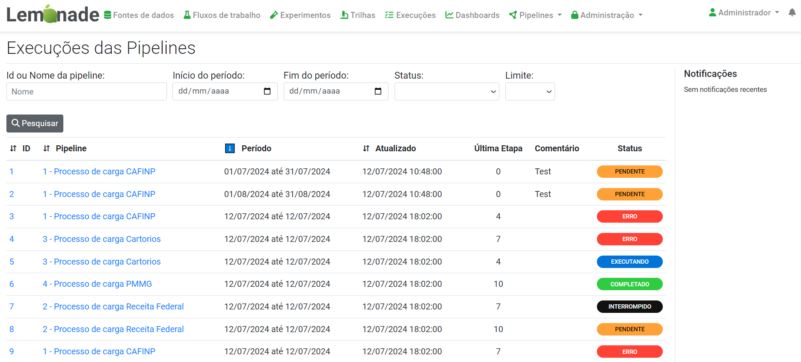
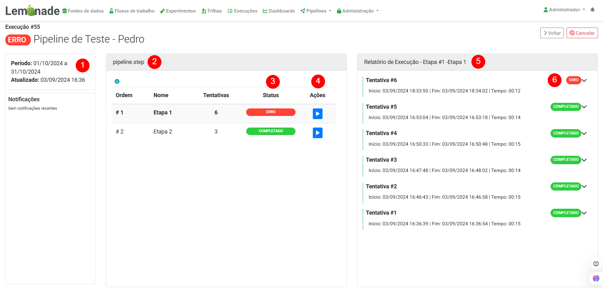

# Monitoramento de Execuções

Considerando o aspecto das execuções das pipelines, surgiu a necessidade de desenvolver uma página que apresentasse a listagem de todas as execuções das pipelines que foram executadas alguma vez. O acesso ao "Histórico de Execuções" pode ser realizado de 3 formas distintas: (i) através do botão "Execuções" disponível na tela de listagem das pipelines, (ii) através do menu Pipelines -> Execuções das Pipelines ou, por fim, (iii) durante a edição de uma pipeline, acessando o botão "Histórico". Neste último caso a listagem das execuções será carregada considerando o filtro pelo ID da pipeline que está sendo editada.

Nota-se que, para cada uma das execuções, é apresentado seu identificador único, a pipeline a qual aquela execução é associada, o período de execução, a última modificação ocorrida na execução, a última etapa executada, um comentário associado e, por fim, o seu status.

Nesse sentido, ao selecionar uma das execuções listadas, o usuário será redirecionado para a página de detalhes da execução, como ilustra a Figura abaixo. É possível notar que a página apresentada é dividida em três partes: i) “Informações da Execução” (#1), onde o usuário verifica o período de execução, a última modificação ocorrida na execução e o seu status, ii)  “Etapas da Execução” (#2) que apresenta as etapas da pipeline com o status de execução (#3) de cada uma delas e a possibilidade de executar manualmente cada uma dessas etapas (#4). Por fim, a parte iii) “Relatório da Execução” (#5) apresenta informações detalhadas sobre cada uma das tentativas de processamento daquela etapa da pipeline. Para cada uma dessas tentativas é apresentado o status da execução (#6) e também um relatório com o log de um eventual erro ocorrido durante o processamento. Além disso, são exibidas duas opções no canto superior direito da página, uma para voltar para a listagem de todas as execuções e outra para cancelar a execução em questão.

Em “Etapas da Execução”, o usuário tem acesso à listagem das etapas da pipeline com o acréscimo de algumas informações, como a quantidade de tentativas de execução de cada etapa, o seu status e a possibilidade do disparo manual.

Ao selecionar uma das etapas presentes em “Etapas da Execução”, é exibido na parte “Relatório da Execução” uma listagem com as tentativas de execução da etapa selecionada, ordenada de forma decrescente considerando as datas/horas de execução. Para cada tentativa é apresentado sua ordem, o seu status, um botão para exibir o stack trace e, ao clicar para expandir uma tentativa, o seu log de execução.
