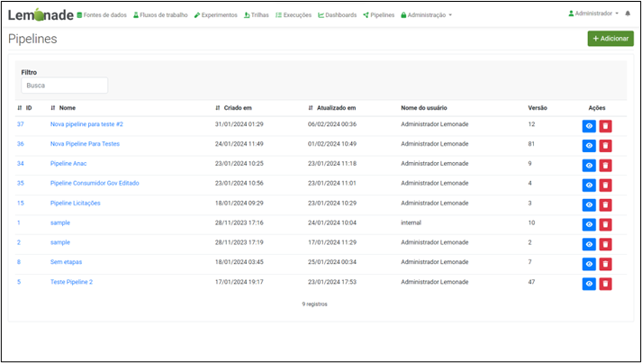
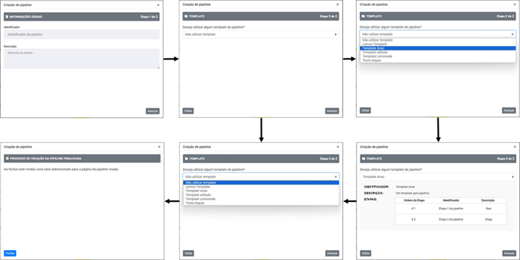
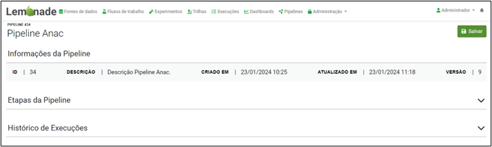
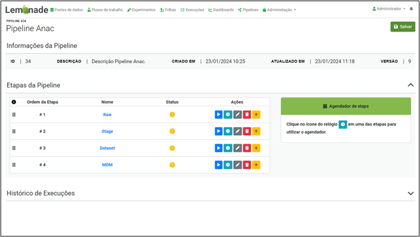

# Gestão de Pipelines

Considerando cada uma das fontes de dados que são processadas pela equipe de engenharia de dados do MPMG, o Lemonade através do módulo Lemon possibilita que o Engenheiro defina pipelines de processamento. Cada uma dessas pipelines é composta por suas camadas de processamento, associadas a um fluxo de trabalho, denominado Workflow. A tela inicial, ilustrada pela figura abaixo, apresenta a listagem de pipelines para Ingestão de Dados.

O processo de criação de uma nova pipeline ocorre ao clicar no botão “Adicionar” disponível na tela de listagem de pipelines. O processo é ilustrado pelas figuras a seguir, que apresenta um wizard que facilita a criação da pipeline. 

Para tal, o engenheiro de dados deverá informar um nome e a descrição para pipeline a ser criada. Em um segundo momento, será apresentada a opção de selecionar um template de pipeline previamente definido ou criar a pipeline sem o uso de template. Caso o engenheiro opte por utilizar algum template será apresentada uma lista com as camadas/etapas definidas no template. Após finalizar o processo, o usuário será direcionado para uma tela como demonstra a figura abaixo.

É possível notar que as informações gerais da pipeline criada, como seu identificador e data de criação são apresentadas no topo da tela. Logo abaixo, as informações são agrupadas em Etapas da Pipeline e Histórico de Execuções.

Ao expandir a “Etapas da Pipeline” o usuário tem acesso à listagem com as etapas/camadas definidas pela “Template Pipeline” escolhida no momento de sua criação. Para cada uma dessas etapas será possível definir o Workflow que será processado após a sua execução, agendar o horário de sua execução e, por fim, excluir ou incluir uma nova etapa/camada de execução. Tais opções são ilustradas pela figura a seguir.

