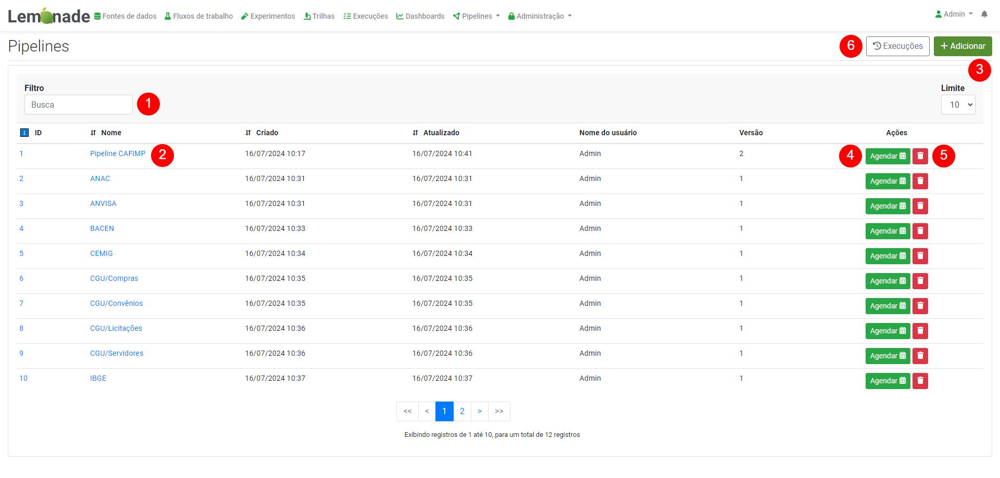
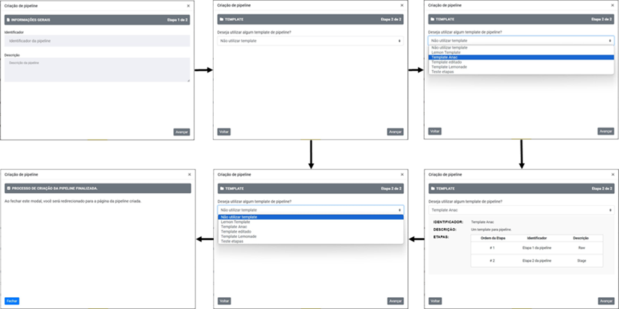
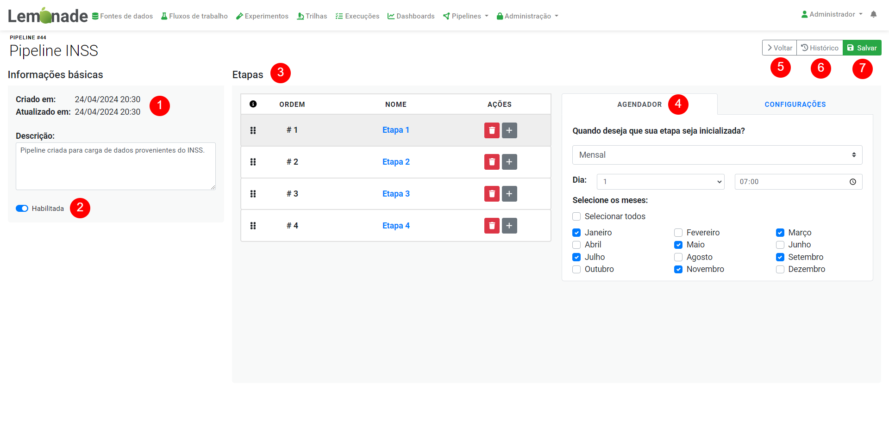

# Gestão de Pipelines

Considerando cada uma das fontes de dados que são processadas pela equipe de engenharia, o LEMONADE através do módulo LEMON possibilita que o Engenheiro defina pipelines de processamento. Cada uma dessas pipelines é composta por suas camadas de processamento, associadas a um Fluxo de Trabalho, denominado Workflow. A tela inicial, ilustrada pela figura abaixo, apresenta a listagem de pipelines definidas pelo engenheiro de dados.

O circulo #1 indica a funcionalidade que permite ao engenheiro de dados aplicar filtros aos dados que são listados na tela. A listagem apresenta o identificador da pipeline (ID), o nome atribuído à pipeline, a sua data de criação e última atualização, o identificador do usuário que criou a pipeline (Nome do usuário), a sua versão e ações que o usuário pode realizar. Para editar uma pipeline já definida basta clicar em seu identificador ou nome conforme indicado em #2. O engenheiro de dados ainda poderá excluir uma pipeline criada ao clicar no botão "Lixeira" (#5) bem como agendar a sua execução clicando no botão "Agendar" (#4). Mais detalhes sobre o agendamento de uma pipeline são apresentados em [Agendamento de Execução](../pipelines/execution-schedule.md). Por fim, essa tela também permite que o engenheiro de dados faça o monitoramento das execuções das pipelines agendadas ao clicar no botão "Execuções" (#6). Para mais detalhes sobre o monitoramento basta acessar [Monitoramento de Execução](../pipelines/monitoring.md).

O processo de criação de uma nova pipeline ocorre ao clicar no botão “Adicionar” (#3) disponível na tela de listagem de pipelines. O processo é ilustrado pelas figuras a seguir, que apresenta um wizard que facilita a criação da pipeline. 

Para tal, o engenheiro de dados deverá informar um nome e a descrição para pipeline a ser criada. Em um segundo momento, será apresentada a opção de selecionar um template de pipeline previamente definido ou criar a pipeline sem o uso de template. Caso o engenheiro opte por utilizar algum template será apresentada uma lista com as camadas/etapas definidas no template. Após finalizar o processo, o usuário será direcionado para uma tela como demonstra a figura abaixo.

É possível notar que as informações gerais da pipeline criada, como seu identificador e data de criação são apresentadas ao lado esquerdo da tela, como ilustra a figura abaixo (#1). Logo abaixo, é possível habilitar/desabilitar a pipeline. Caso ela esteja desabilitada, a sua execução não será processada (#2).

Ao expandir a “Etapas da Pipeline” o usuário tem acesso à listagem com as etapas/camadas definidas pela “Template Pipeline” escolhida no momento de sua criação. Para cada uma dessas etapas será possível definir o Workflow (aba ao lado de #4) que será processado após a sua execução, agendar o horário de sua execução (#4) e, por fim, excluir ou incluir uma nova etapa/camada de execução (#3). No topo da página, à direitra, temos ações de "Voltar" à tela de listagem (#5), visualizar o "Histórco" de execução da pipeline (#6) e "Salvar" as edições realizadas (#7).

