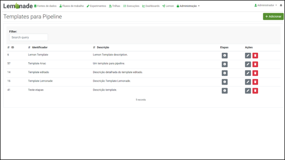
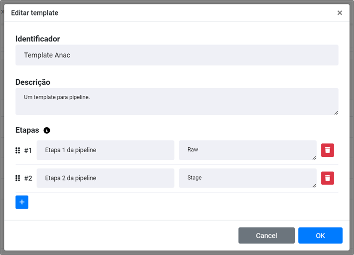

# Templates para Pipeline

Considerando a padronização das camadas de Ingestão de Dados do MPMG adotada pela equipe de Engenharia de Dados, o Lemon disponibiliza uma funcionalidade que permite ao engenheiro responsável criar templates de pipelines que poderão ser adotados pelos processos de Ingestão de Dados. Estes templates definem padrões de camadas que serão adotados durante a construção de uma pipeline. 

A figura abaixo ilustra a tela proposta onde é possível visualizar a listagem de templates criados, que neste caso são 5. Para cada template proposto é possível acessar as suas etapas estabelecidas assim como editá-las e/ou remover o template.

Caso necessário, o engenheiro de dados poderá criar um novo template de Pipeline clicando no botão “Adicionar”. Neste caso, o Lemonade apresentará uma tela para a definição das informações do template a ser criado. Assim, além de seu nome e descrição, o Engenheiro de Dados deverá definir quais as camadas/etapas deverão existir caso o usuário adote o template proposto. 

A figura abaixo ilustra este processo.

