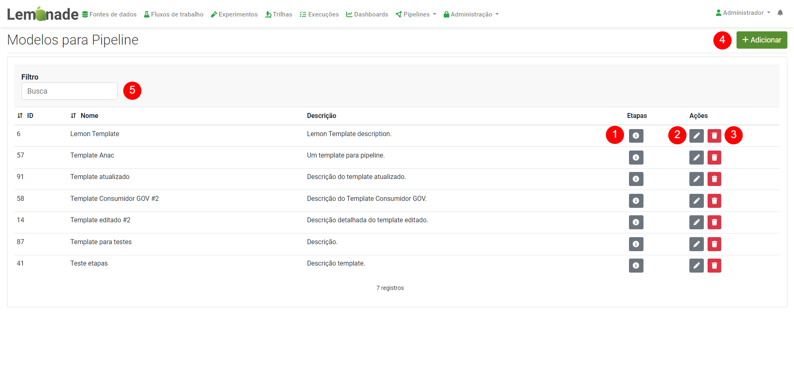
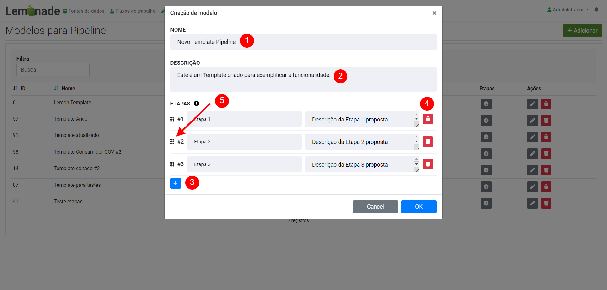

# Templates para Pipeline

Considerando a padronização das camadas de Ingestão de Dados do cliente LEMON/LEMONADE adotada pela equipe de Engenharia de Dados, o LEMON disponibiliza uma funcionalidade que permite ao engenheiro responsável criar Templates de Pipelines que poderão ser adotados pelos processos de Ingestão de Dados. Esses templates definem padrões de camadas que serão adotados durante a construção de uma pipeline. 

A figura abaixo ilustra a tela proposta onde é possível visualizar a listagem de templates criados, que neste caso são 7. Para cada template proposto é possível visualizar as suas etapas (#1) estabelecidas assim como editá-las (#2) e/ou remover (#3) o template.

Caso necessário, o engenheiro de dados poderá criar um novo Template de Pipeline clicando no botão “Adicionar” (#4). Nesse caso, o LEMONADE apresentará uma tela para a definição das informações do template a ser criado. A figura abaixo ilustra este processo. 

Assim, além de seu nome (#1) e descrição (#2), o Engenheiro de Dados deverá definir quais as camadas/etapas deverão existir clicando no botão "+" (#3). Para cada etapa criada será necessário informar o seu nome e descrição associada. Ainda existe a possibilidade de excluir uma etapa criada de forma equivocada ao cliclar no botão de "Lixeira" (#4). Por fim, é possível alterar a ordem das etapas inicialmente propostas arrastando a etapa para cima ou para baixo conforme indicado por #5.
