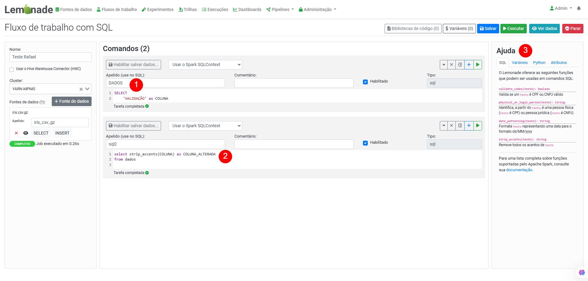

# Funções SQL customizadas pelo usuário e registro de tabelas temporárias

Outra funcionalidade da plataforma é a possibilidade de criação de funções definidas pelo usuário em Spark (sigla do inglês User Defined Function - UDF) para a reusabilidade de etapas de processamento em colunas de Dataframes Spark. As funções são implementadas utilizando a linguagem Java e registradas no Spark para que sejam utilizadas pelos usuários do LEMONADE, de forma a garantir maior desempenho em relação a uma abordagem tradicional, caso fossem executadas em Python.

Como essas funções estão definidas apenas para o Spark, a execução de códigos em SQL diretamente pelo Hive (via método executeQuery) não é disponível. Para utilizar tais funções, as tabelas precisam estar registradas no contexto do Spark. Existem duas formas de fazer esse registro: a primeira é a partir da interface do Limonero. Já a segunda possibilidade é a partir de um registro temporário pelo Spark, que registra temporariamente a tabela de entrada com o nome de dados, como apresentado na figura abaixo (#1).

Uma vez garantido o registro da fonte de dados, podemos criar códigos SQL referenciando o apelido definido para essa fonte (no exemplo, “DADOS”). Como essa fonte está registrada no Spark, é possível executar o código SQL diretamente pela ferramenta; nesse contexto, o Spark irá ler os dados do Hive e processar o fluxo submetido. Execuções desse tipo podem ser desejáveis em alguns contextos para evitar gargalos de processamento provocados pela alta utilização do Hive no momento. No parágrafo seguinte (#2), o valor da coluna inicialmente "VALIDAÇÃO" foi submetido à UDF "strip_accents" que remove a acentuação das informações da coluna passada como argumento.  Por fim, destacado em #3 na figura, o recurso de "Ajuda" com a lista das UDFs atualmente disponíveis na plataforma LEMONADE.

