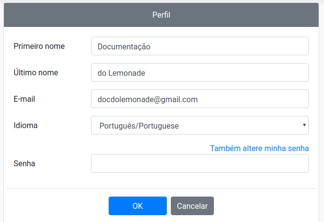

# Perfil de usuário

Para alterar as informações do usuário, clique sobre o seu nome no canto superior 
direito da tela e depois em Perfil:

Uma tela de edição de dados do usuário aparecerá, como indicado na imagem a 
seguir. Nessa tela é possível ainda escolher o idioma da plataforma 
(português ou inglês). Clique em OK para aplicar as alterações feitas.

Para alterar a senha, o usuário deverá clicar em Também altere a minha senha, 
estendendo a tela acima para a imagem a seguir. Em seguida, é necessário 
preencher a nova senha. Para finalizar a troca, clique em OK.

