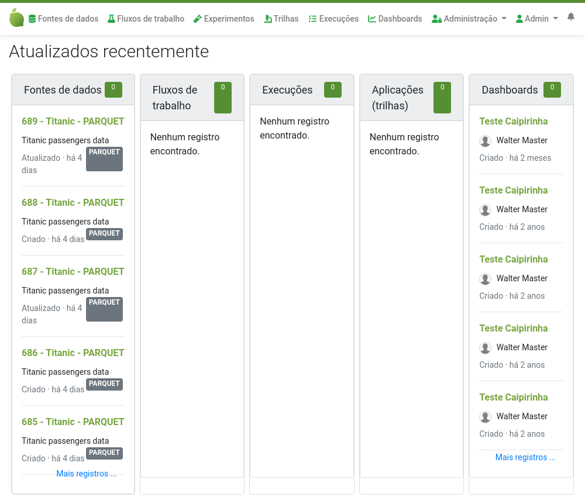

# Entendendo a página principal do Lemonade

Após ter se autenticado no Lemonade, você é encaminhado para a tela principal, 
também chamada de `Home`.

A tela principal tem listas ordenadas, 
dos mais recentes para os mais antigos, com os principais artefatos do Lemonade:

- Projetos
- Fontes de dados
- Fluxos de trabalho
- Execuções
- Aplicações
- Dashboards

<script-info spec="tutorial_home_page.cy.js"/>
