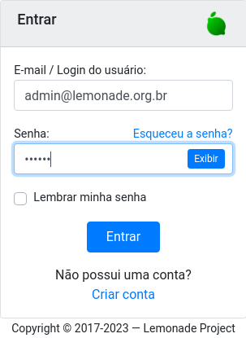

# Como se autenticar no Lemonade (login)

Para se autenticar no Lemonade:

1. Navegue até a página http://localhost:8081/auth/login
2. Preenchar o campo <code>Email / Login do Usuário</code> com o valor _admin@lemonade.org.br_.
3. Preenchar o campo <code>Senha</code> com o valor _123456_.

4. Click o botão <code>Entrar</code>.
5. Você deverá ser autenticado e encaminhado para a página inicial do Lemonade. 

Caso o login de usuário ou a senha estejam incorretos, um aviso será exibido. 
Se você não se lembrar da senha, você pode clicar o link <code>Esqueceu a senha?</code>. 
O Lemonade irá enviar uma mensagem para o email informado, contendo as 
instruções necessárias para você informar uma nova senha.

Se você quer criar um novo usuário, você pode clicar o link <code>Criar conta</code>. 
Novamente, uma mensagem será enviado para o email de cadastro solicitando a 
confirmação. Também é necessário que um administrador do Lemonade autorize 
a criação da nova conta.

<script-info spec="tutorial_login.cy.js"/>
