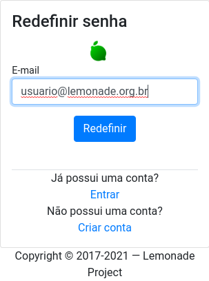
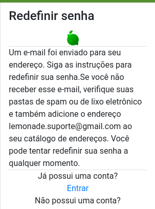

# Como reiniciar a senha perdida no Lemonade

Para reiniciar sua senha (uma nova será criada):

1. Navegue até a página http://localhost:8081/auth/login
2. Preenchar o campo <code>Email</code> com __o seu email__.

4. Click o botão <code>Redefinir</code>.
5. Se o seu email estiver cadatrado, você receberá uma mensagem como na tela a seguir: 

Se seu email não for encontrado, certifique-se de que o digitou corretamente. 
Caso o problema persista, entre em contato com o suporte ou crie uma nova conta.

<script-info spec="tutorial_reset_password.cy.js"/>
